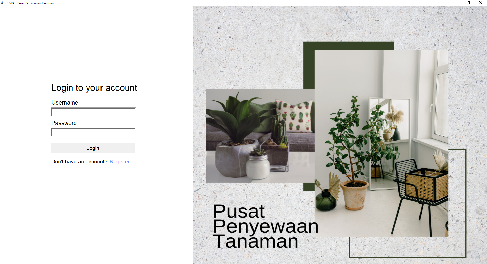
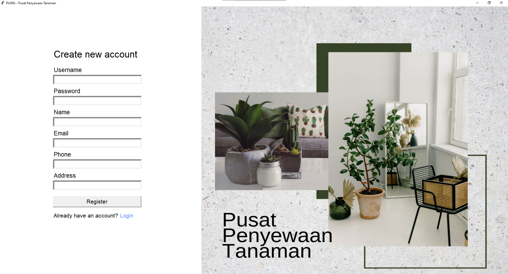

# IF2250-2022-K03-06-Puspa

Implementasi Perancangan Perangkat Lunak Puspa (Pusat Penyewaan Tanaman)

## Penjelasan Program
Puspa (Pusat Penyewaan Tanaman) merupakan sebuah perangkat lunak berbasis desktop yang digunakan untuk menyewa tanaman. Pengguna yang mengakses perangkat lunak terbagi menjadi dua, yaitu admin dan user. Admin dapat melihat daftar pesanan user, melihat katalog, dan mengedit tanaman yang tersedia. Sedangkah user dapat melihat daftar pesanan, melihat katalog, dan menyewa tanaman yang tersedia.

Dalam penggunaan perangkat lunak ini, user perlu melakukan registrasi terlebih dahulu sebelum menggunakan perangkat lunak. User yang sudah terdaftar dapat melakukan login untuk menggunakan perangkat lunak. Setelah user melakukan login, user dapat melihat daftar pesanan, melihat katalog, dan menyewa tanaman yang tersedia.

Sedangkan untuk admin, admin sudah terdaftar oleh sistem. Admin dapat melakukan login langsung untuk menggunakan perangkat lunak. Setelah admin melakukan login, admin dapat melihat daftar pesanan user, melihat katalog, dan mengedit tanaman yang tersedia. 

## Cara Menjalankan Aplikasi
1. Install [python]
2. Install Tkinter
```
pip install tk
```
3. Install Pillow
```
pip install Pillow
```
4. Buka folder [src]
```
cd src
```
5. Jalankan [main.py]
```
python main.py
```
## Daftar Modul
### Modul Login
Penanggung jawab : Mohamad Hilmi Rinaldi (13520149)



### Modul Registrasi
Penanggung jawab : Mohamad Hilmi Rinaldi (13520149)



### Modul Menu
Penanggung jawab : Tri Sulton Adila (13520033)

### Modul Katalog Tanaman
Penanggung jawab : Tri Sulton Adila (13520033)

### Modul Daftar Pesanan
Penanggung jawab : Bryan Amirul Husna (13520146)

### Modul Halaman Produk
Penanggung jawab : Bryan Amirul Husna (13520146)

### Modul Editor Data Tanaman
Penanggung jawab : Zayd Muhammad Kawakibi Zuhri (13520144)

## Daftar Tabel Basis Data
### Tabel User
- Tabel User berisi data customer dan admin yang sudah terdaftar
- Nama tabel: user
- Atribut:
    - username : bertipe TEXT dan bersifat primary key
    - name : bertipe TEXT
    - email : bertipe TEXT
    - password : bertipe TEXT
    - address : bertipe TEXT
    - phone_number : bertipe TEXT
    - role : bertipe TEXT

### Tabel Tanaman
- Tabel Tanaman berisi data tanaman yang tersedia
- Nama tabel: tanaman
- Atribut:
    - item_id : bertipe INTEGER (AUTO INCREMENT) dan bersifat primary key
    - item_name : bertipe TEXT
    - current_price : bertipe INTEGER
    - description : bertipe TEXT
    - stock : bertipe INTEGER
    - image_path : bertipe TEXT

### Tabel Pesanan
- Tabel Pesanan berisi data pesanan yang dilakukan
- Nama tabel: pesanan
- Atribut:
    - order_id : bertipe INTEGER (AUTO INCREMENT) dan bersifat primary key
    - username : bertipe TEXT dan foreign key ke user(username)
    - item_id : bertipe INTEGER dan foreign key ke tanaman(item_id)
    - status : bertipe TEXT
    - order_date : bertipe TEXT
    - duration : bertipe INTEGER
    - quantity : bertipe INTEGER
    - unit_price : bertipe INTEGER
